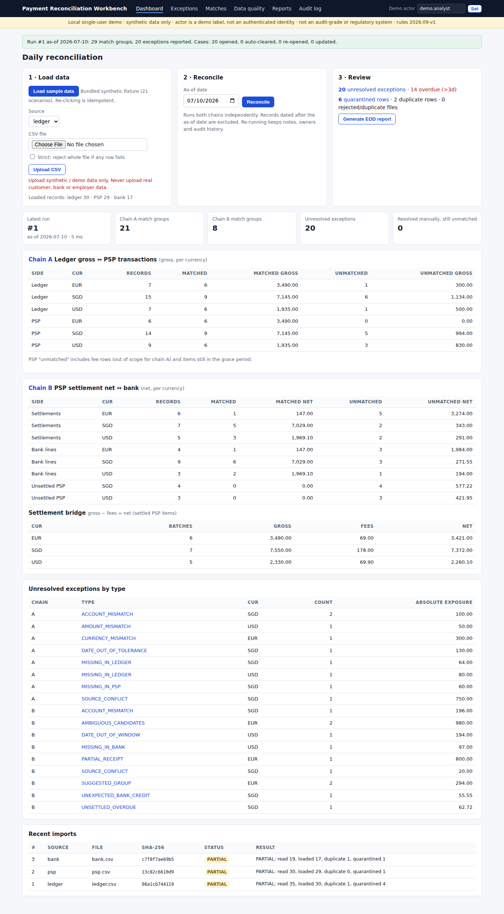

# Payment Reconciliation Workbench — project overview

A local web tool that checks whether the money a business booked, the money its payment provider processed and
the money that reached the bank all agree, and turns each disagreement into a tracked case with the evidence
attached. It is a portfolio project that runs on synthetic sample data.



## The business problem
When a customer pays an online shop, the same payment appears in three places:
1. the shop's own books: an order sold for 1,000.00;
2. the payment provider's report: 1,000.00 processed, a 20.00 fee kept, 980.00 paid out;
3. the bank statement: 980.00 received.

A payments-operations analyst has to confirm every day that these agree. Common complications: a payout arrives
in two parts or combined with another payout, two payouts have the same amount, a file is sent twice, a row
contains a typo, or a bank line arrives a day late. In a spreadsheet it is easy to count a file twice or to
compare the 1,000.00 with the 980.00.

## What the tool does
- **Imports and validates** the three files. Bad rows are set aside with a reason, and re-sending the same file
  does not count it twice.
- **Compares in two steps:** books against provider before fees, then provider payout against bank after fees.
- **Matches automatically only when there is exactly one valid answer.** Anything ambiguous becomes an exception
  for review.
- **Tracks exception cases** with an owner, a status, notes and a history of every change.
- **Produces an end-of-day report** (web page plus CSV files), keeping each currency separate.

## Example: a normal payment
Order ORD-1001 is booked at 1,000.00 SGD. The provider reports 1,000.00 processed, a 20.00 fee and 980.00 paid out
in batch STL-SG-0703. The bank shows 980.00 with reference STL-SG-0703. Both steps match automatically, and the
screen shows the rule that matched: same reference, exact amount, dates within the allowed window.

## Example: a short payment, then recovery
Batch STL-EU-0705 should pay 2,000.00 EUR, but the bank shows only 1,200.00.
1. A **partial receipt** case opens with 800.00 outstanding, pointing to the exact file and row of each record.
2. The case is assigned, a note is added ("asked provider for the remainder") and it is marked *In review*.
3. The next day's statement includes the missing 800.00. On the re-run, 1,200.00 + 800.00 = 2,000.00 matches and
   the case closes automatically with the reason recorded; the note and history remain.

The sample data also includes a 50.00 shortfall, two same-amount payouts the tool will not choose between, a
payment to the wrong bank account, a currency mismatch, conflicting versions of one record, and badly formatted
amounts and dates.

## 3-minute demo
1. **Load sample data**: rejected rows are counted and listed on the data-quality page.
2. **Reconcile**: two result panels (before fees and after fees), per currency.
3. **Exceptions**: for example the ambiguous same-amount payouts and the 50.00 shortfall.
4. Work the partial-receipt case, upload the late bank file, re-run: the case closes with an explanation.
5. **Generate EOD report**.

Full script: [demo-script.md](demo-script.md).

## Screenshots
| | |
|---|---|
| Dashboard | [01_dashboard.png](evidence/screenshots/01_dashboard.png) |
| Matched payouts (split / combined / exact) | [02_matches_chain_b.png](evidence/screenshots/02_matches_chain_b.png) |
| Exceptions list | [03_exceptions.png](evidence/screenshots/03_exceptions.png) |
| Partial-receipt case with source rows | [04_case_partial_receipt.png](evidence/screenshots/04_case_partial_receipt.png) |
| Same case closed after the late bank data | [05_case_auto_cleared_after_late_data.png](evidence/screenshots/05_case_auto_cleared_after_late_data.png) |
| Data-quality page | [06_data_quality.png](evidence/screenshots/06_data_quality.png) |

## Technology and setup
Python 3.11, SQLite, Flask (server-rendered pages), pytest, Playwright with Chromium, GitHub Actions. Runs
offline with no API keys; matching is deterministic and rule-based.

```bash
python3 -m venv .venv && . .venv/bin/activate && pip install -r requirements.txt
python -m recon --db work/demo.db serve     # then open http://127.0.0.1:5000
```

## Testing
| | |
|---|---|
| 127 automated tests, including a browser run | [pytest_output.txt](evidence/pytest_output.txt) |
| 21 hand-written scenarios with expected answers | [tests/golden](../tests/golden/README.md) |
| Command-line walkthrough: duplicate files, case handling, late data, repeat run | [cli_walkthrough.txt](evidence/cli_walkthrough.txt) |
| Sample end-of-day reports | [sample_reports](evidence/sample_reports/) |
| Benchmark on generated data (up to ~30,000 ledger rows): 0 false automatic matches in 5 datasets; 47.3 % auto-matched on the hardest dataset, the rest sent to review | [benchmark_results.md](../benchmark/results/benchmark_results.md) |
| Defects found and fixed | [defects.md](defects.md) |

## Scope and limitations
- **Data:** synthetic sample and benchmark data only; no connection to any bank or payment provider. Field
  choices follow Stripe's public
  [payout reconciliation docs](https://docs.stripe.com/reports/payout-reconciliation); there is no Stripe
  integration.
- **Scope:** single user on one computer, without login or approval workflow; the audit history is append-only
  within the app, not a regulatory record. SGD, USD and EUR only; no currency conversion, chargebacks or real
  bank file formats.
- **Validation:** automated developer tests on generated data; no external user testing yet
  ([UAT.md](UAT.md)). Benchmark results reflect the generated data, not production accuracy.

More: [README](../README.md) · [matching rules](matching-rules.md) · [requirements](requirements.md) ·
[process before/after](process-as-is-to-be.md) · [status](../STATUS.md)
