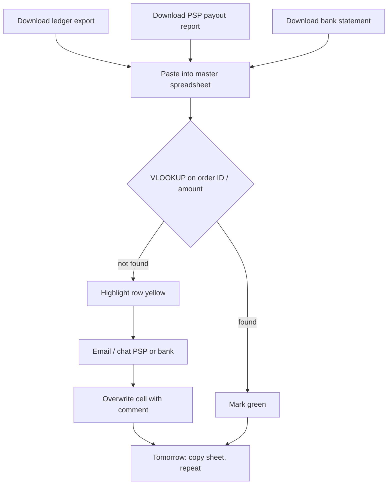
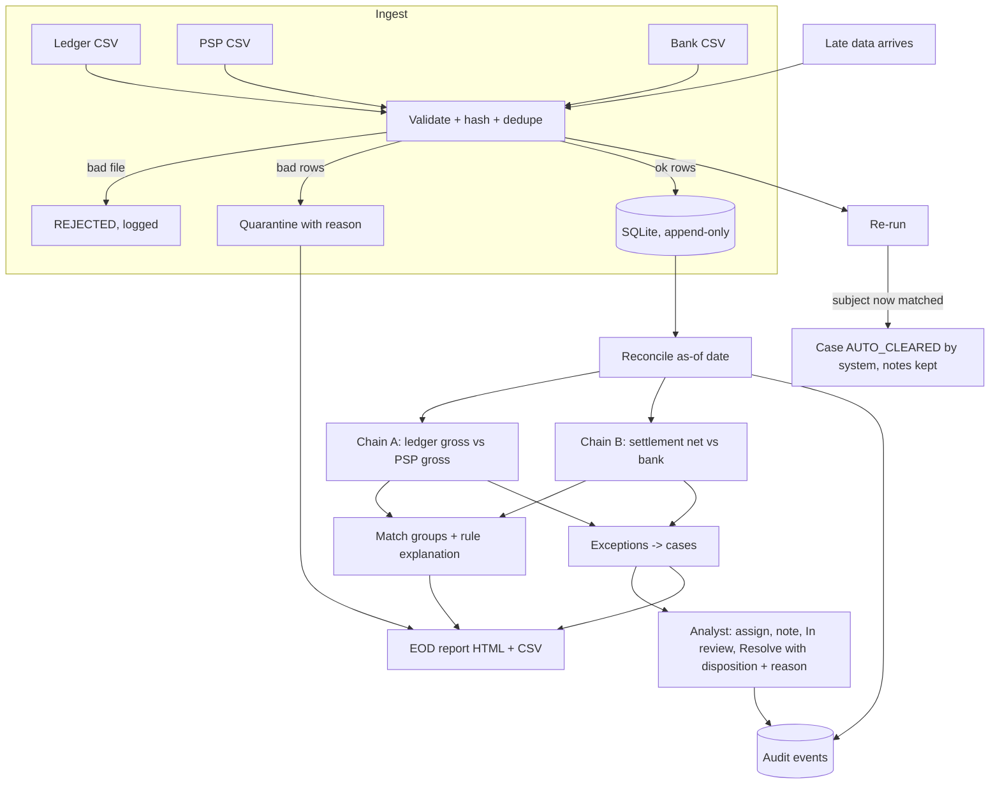
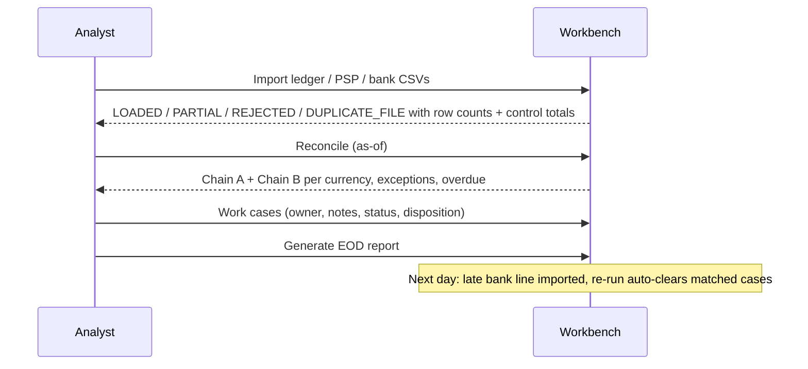

# As-is → To-be process

The "as-is" below is a **generic, assumed** manual process for a small payments operations team, written for
this portfolio project. It is not a description of any specific employer.

## As-is (assumed manual spreadsheet process)

Pain points (assumed): the same file pasted twice double-counts; amount lookups silently pick the first of two
equal amounts; gross and net get mixed in one total; currencies are summed; comments are overwritten; no record
of who decided what; late bank lines are not linked back to yesterday's open item.

## To-be (this workbench)

## Daily sequence (to-be)

